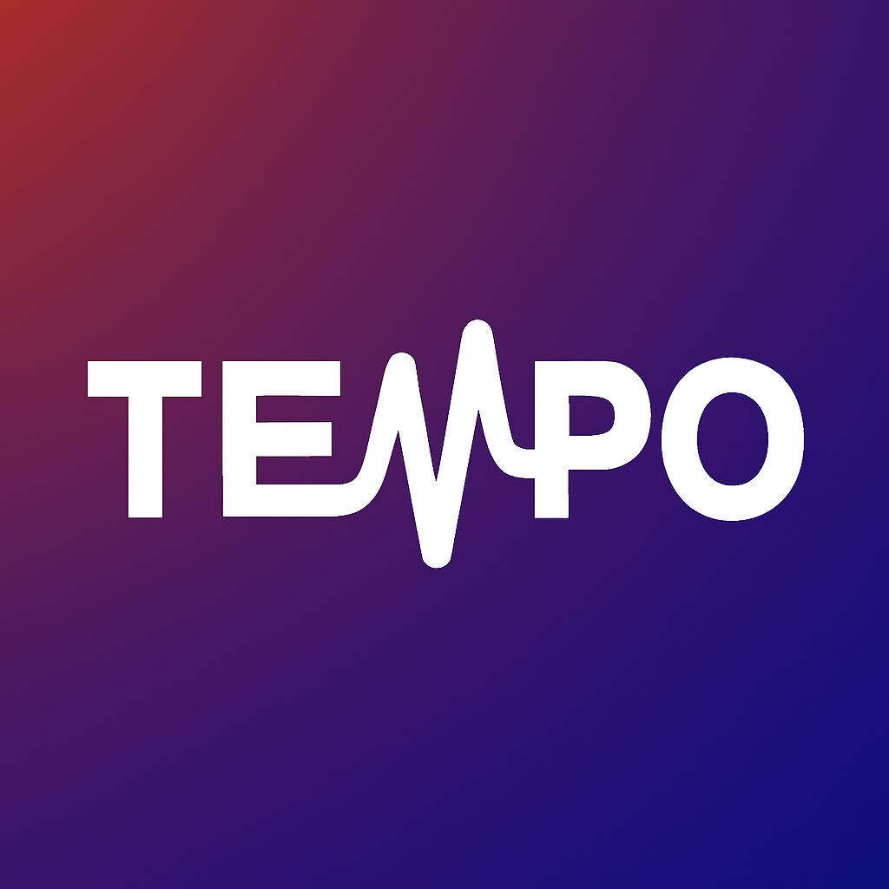

# Tempo

<div align="center">
  
  <h1>Your Year in Music, Every Day.</h1>
  <p>
    <b>Universal Music Tracking • Privacy-First Analytics • Real-Time Insights</b>
  </p>

  [](https://kotlinlang.org/)
  [](https://developer.android.com/jetpack/compose)
  [](https://github.com/avinaxhroy/Tempo/blob/main/PRIVACY.md)
  [](#)

</div>

---
## 📥 Download
<div align="center">
  <a href="https://github.com/avinaxhroy/Tempo/releases">
    
  </a>
  <a href="https://play.google.com/store/apps/details?id=me.avinas.tempo">
    
  </a>
</div>

## Why Tempo?

Most music apps lock your stats behind a yearly barrier. **Tempo breaks that wall.**

It runs silently in the background, building a comprehensive, "Spotify Wrapped"-style profile of your listening habits in **real-time**. Whether you're streaming 2024's hits or spinning local MP3s from 2005, Tempo tracks it all, unifies it all, and presents it with a level of polish and poetry you've never seen before.

### 🚫 The Problem
*   **Fragmented History:** You listen on Spotify, YouTube Music, and local players. Your stats are scattered everywhere.
*   **The Waiting Game:** You have to wait until December to see your "Top Songs."
*   **Surface-Level Data:** Most apps just tell you *what* you played, not *how* it felt.

### ✅ The Tempo Solution
*   **Universal Sync:** Tracks music from **20+ apps** (Spotify, Apple Music, YouTube Music, etc.) and unifies them into one timeline.
*   **Instant Spotlight:** View your "Year in Review" for *any* time range (Today, This Week, All Time), instantly.
*   **Poetic Insights:** We don't just count plays; we analyze your "Vibe," your "Era," and your "Listening Personality."

---

## The "Wow" Features

Tempo isn't just a database; it is a **visual experience**.

### 🌟 Living Spotlight Stories
Your stats come alive with our **Story Engine**, designed for sharing:
*   **The Pulse:** Visualizes your listening minutes with a gentle heartbeat animation that speeds up as you listen more.
*   **Smart Audio:** Stories fade in/out with volume normalization, preloading background tracks for a seamless audiovisual experience.
*   **Floating Genres:** Interactive bubbles float on screen to visualize your top genres with conversational insights.
*   **Personality Pulsar:** A cinematic reveal of your specific listening archetype (e.g., "The Party Starter", "Intense Soul").
*   **The Conclusion Grid:** A beautiful, shareable "all-in-one" summary card that aggregates your listening time, top artist, and personality.

### 📊 Deep Dive Stats
Go beyond simple play counts with granular analytics for every Artist and Song:
*   **Fan Status Badges:** Are you a "Casual Listener" or an "Ultimate Stan"? Earn badges based on your percentile ranking (e.g., Top 1%).
*   **Discovery Timelines:** *"You found them on Oct 12, 2021. Since then, you've streamed 40 hours."*
*   **Engagement Scores:** A **0-100 score** for every song, calculated from:
    *   **Skip Rate:** Do you press next immediately?
    *   **Completion Rate:** Do you listen to the sudden end?
    *   **Replay Intensity:** Do you play it back-to-back?
*   **Trend Graphs:** Beautiful cubic-bezier charts showing a song's popularity over time.

### 🧠 Deep "Vibe" Analysis
We go beyond genres to understand the *texture* of your music:
*   **Mood Modes:** Are you in a "High Energy Mode" or an "Acoustic Soul" phase? Tempo analyzes Energy, Valence, and Danceability.
*   **Personality Profiles:**
    *   **The Completionist:** You finish every album you start.
    *   **The Night Owl:** Your best listening happens after midnight.
    *   **The Fabricator:** You curate disparate tracks into cohesive playlists.
*   **Behavioral Tracking:** Detects "Binges" (repetitive listening) and "Streaks" (daily consistency).

### 🌍 Hemisphere-Aware Poetry
Tempo is crafted with a global audience in mind.
*   **Seasonal Awareness:** The app detects your location (Northern vs. Southern Hemisphere) and adjusts its poetic summaries accordingly.
    *   *Northern October:* "October sharpens the picture."
    *   *Southern October:* "October gathers momentum."
*   **Global Context:** Whether you're in a tropical zone or the arctic, Tempo's language reflects *your* season.

---

## Design & Privacy

### 🎨 Deep Ocean Design
*   **Glassmorphism:** A custom-built UI system featuring frosted glass cards, dynamic blurs, and "warm violet" accents.
*   **Fluid Motion:** Every screen transition, list item, and chart is animated for a premium feel.
*   **Smart Colors:** The UI extracts vibrant colors from your album art to create immersive, matching backgrounds.
*   **Shadow Renderer:** When you share a story, Tempo generates it off-screen at exactly **1080x1920px** (Instagram Story standard) to ensure it looks pixel-perfect on any device.

### 🔒 Zero-Compromise Privacy
**Your data is YOURS. Period.**
*   **Local First:** All data is stored in a `Room` database directly on your device.
*   **No Servers:** We have no backend. We couldn't sell your data even if we wanted to.
*   **Full Control:**
    *   **Export:** Download your entire history (including cached images) as a ZIP file.
    *   **Import:** Restore backups with smart conflict resolution (Skip vs. Replace).
    *   **Clear:** Wipe everything with one button.

---

## 🙋 Frequently Asked Questions

### 🎵 How is this different from Last.fm?
Tempo is a **standalone music stats app**, not just a scrobbler. It stores your listening history **locally** on your device, works without any account, and focuses on **deep insights and visual stories** rather than social features.

### 🔒 Is my data safe?
**Yes.** Tempo is privacy-first and open source. All your listening data stays on your phone. We don't have servers, and we don't collect any user analytics. You are in full control of your data.

### 🎧 Why connect Spotify?
Connecting Spotify is **completely optional**. It's used *only* to fetch better metadata (artist genres, high-resolution cover art) for your tracks. Tempo tracks your music via Android notifications, so it works perfectly even without connecting Spotify.

### 📺 Does it work with regular YouTube?
**Currently, no.** We stick to YouTube Music to ensure we only track actual songs. Regular YouTube often mixes in non-music videos (vlogs, tutorials), which would clutter your music stats with irrelevant data.

### 🍎 Is there an iOS version?
**Not at the moment.** As a student developer offering this app for free and without ads, the high cost of the Apple Developer Program ($99/year) makes an iOS version impractical right now.

### 🔄 What if I change phones?
Since data is local, it lives on your device. However, **Tempo now supports Google Drive Backup.** You can back up your entire listening history to your private Google Drive and restore it seamlessly on a new phone during onboarding.

---

## Technical Mastery

Ideally suited for developers and enthusiasts who appreciate clean architecture.

### Under the Hood
*   **Architecture:** Clean Architecture + MVVM.
*   **Language:** 100% Kotlin.
*   **UI:** Jetpack Compose (Single Activity).
*   **Dependency Injection:** Hilt / Dagger.
*   **Background Tasks:** WorkManager (Reliable Enrichment & Notifications).
*   **Image Loading:** Coil (with sophisticated caching strategies).

### Smart Enrichment Engine
When you play a song, Tempo triggers a **6-Stage Fallback Strategy** to find the perfect metadata:
1.  **Spotify:** Primary source for High-Res Art & Audio Features.
2.  **MusicBrainz:** The gold standard for open metadata.
3.  **Last.fm:** Crowd-sourced tags and bio data.
4.  **iTunes:** High-quality fallbacks for regional/niche tracks.
5.  **Deezer:** Additional cover art source.
6.  **ReccoBeats:** (Internal) Last line of defense.

*Note: This runs silently in the background, respecting API rate limits and battery life.*

---

## Download & Build

### 📥 Get the App
*Currently in private beta. Check the [Releases](https://github.com/avinaxhroy/Tempo/releases) tab for the latest APK.*

### 🛠️ Build from Source
Prerequisites: Android Studio Koala+, JDK 17.

```bash
# 1. Clone the repo
git clone https://github.com/avinaxhroy/Tempo.git

# 2. Add your API keys (Optional for core tracking, required for Enrichment)
# Create a local.properties file and add:
# spotify.client.id=YOUR_ID
# spotify.client.secret=YOUR_SECRET

# 3. Build
./gradlew assembleDebug
```

---

## License

Tempo is open-source software. You are free to view, learn from, and modify the code for personal use.
**Commercial redistribution, rebranding, or selling of this application is strictly prohibited.**

See the [LICENSE](LICENSE) file for details.

---

<div align="center">
  <p>Made with ❤️ and too much caffeine by Avinash.</p>
</div>
