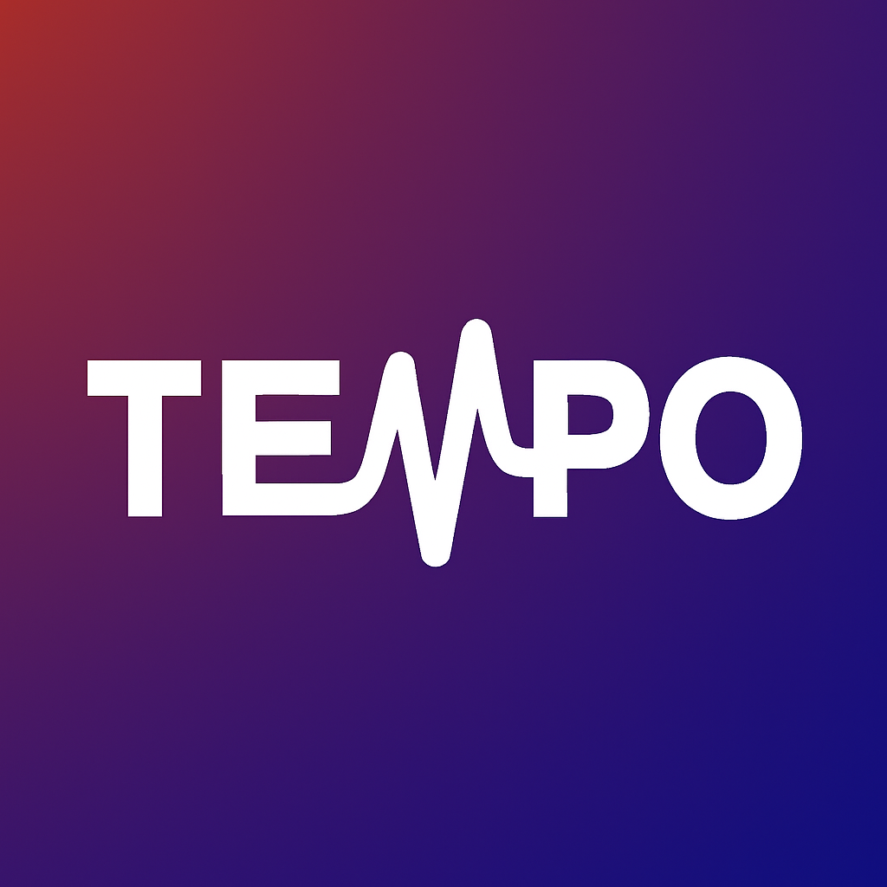

# Tempo: Your Music Journey, Preserved.

<p align="center">
  
</p>

<p align="center"><a href='https://play.google.com/store/apps/details?id=me.avinas.tempo.release'></a></p>

<div align="center">


[](https://kotlinlang.org) 
[](https://developer.android.com) 
[]()
[](LICENSE) 
[]()


</div>
 

**Tempo** is the ultimate **local-first music companion** that turns your listening history into a permanent, stunningly visualized journal. It connects with all your favorite players, preserves your data privately on your device, and transforms raw stats into deep insights and beautiful memory stories.

Unlike traditional scrobblers that just count plays, Tempo acts as a **Memory Engine**, capturing the context, mood, and "vibe" of every moment you spend with music.

---

## ⚡ Why Tempo?

Most music apps lock your data inside their walled gardens. Tempo liberates it.
Built with a **Local-First** philosophy, Tempo listens to what you play across **any app**, enriches it with metadata, and stores it securely on your device.

- **Universal Sync**: Works with Spotify, YouTube Music, and 50+ other players.
- **Deep Insights**: Goes beyond "Top Tracks" with Vibe Analysis, Listening Quality Scores, and Mood trends.
- **Spotlight Stories**: Your personal "Wrapped," generated on-demand, any time.
- **Zero Cloud Dependency**: Your data lives on your phone. No servers, no tracking.

---

## 🎧 Universal Sync Engine

Tempo's `ScrobbleEngine` detects music from almost any audio source on Android.

### Supported Player Categories
| Category | Examples |
|----------|----------|
| **Streaming Giants** | Spotify, YouTube Music, Apple Music, Deezer, Tidal, Amazon Music |
| **Audiophile & Local** | Poweramp, Neutron, Musicolet, BlackPlayer, GoneMAD |
| **Region Specific** | JioSaavn, Gaana, Wynk, Resso, Anghami |
| **FOSS & Privacy** | ViMusic, InnerTune, Metro, Namida, Auxio |
| **System** | Samsung Music, Mi Music, Sony Music |

> **Tech Note**: Uses `NotificationListenerService` with a smart filter to ignore system sounds. Includes specific options to **Filter Podcasts** and **Filter Audiobooks** to keep your music stats pure.

---

## 🔄 Import & Integration

Tempo bridges the gap between your past and present listening.

### 📊 Last.fm Import (Two-Tier Architecture)
Importing 10+ years of history can crush mobile apps. Tempo solves this with a unique **Two-Tier System**:
1.  **Active Set**: Your top tracks and recent history (~1 year) are imported as full database objects for instant stats, charts, and leaderboards.
2.  **Archive Tier**: Older, long-tail data (songs played once 5 years ago) is stored in a highly compressed `ScrobbleArchive`, keeping the app fast while preserving 100% of your history for search and browsing.

### 🟢 Spotify Integration
- **Mood Analysis**: Connects to Spotify API to fetch Energy, Valence, and Danceability data for your tracks.
- **API-Only Mode**: Save battery by disabling the notification listener. Tempo will poll Spotify's `Recently Played` API every 15 minutes via `SpotifyPollingWorker` instead.

---

## 🎨 Spotlight: Art from Data

Tempo doesn't just show charts; it creates **art**. The **Spotlight Engine** uses your listening patterns to generate dynamic, shareable cards using Jetpack Compose Canvas.

### Visualization Types
- **🌌 Cosmic Clock (Vedic Astronomy)**: Visualizes your listening time on a 24-hour radial chart inspired by the *Samrat Yantra* sundial.
- **🏛️ Weekend Warrior (Constructivism)**: A 3D isometric architectural view comparing your weekday vs. weekend listening intensity.
- **✨ Kintsugi (Golden Repair)**: Relights "Forgotten Favorites" (songs you loved but stopped playing) with gold-filled cracks, symbolizing rediscovered memories.
- **🌀 Sonic Immersion (Op Art)**: A hypnotic, optical illusion tunnel representing your deepest "binge" sessions.
- **🖋️ Hemisphere-Aware Poetry**: Generates seasonal poetic descriptions of your month (e.g., *"October sharpens the picture"* in the North vs *"October gathers momentum"* in the South).

---

## 🧠 Smart Tech & "Hidden Gems"

Tempo is packed with engineering details designed for reliability and depth.

### 🛡️ Anti-Kill Engineering
Android OEMs (especially Xiaomi/HyperOS) are notorious for killing background apps.
- **OemBackgroundHelper**: A specialized module that detects the specific OS (MIUI, HyperOS) and guides users to the exact settings needed to keep Tempo alive.
- **Reliability**: Includes `ServiceHealth` workers that self-heal if the background service is terminated.

### 🔊 ReccoBeats Enrichment
When Spotify metadata fails, Tempo falls back to its own **5-Layer Enrichment Engine**:
1.  **Spotify ID Match**: Precise metadata from Spotify API.
2.  **ReccoBeats Search**: Fuzzy matching against internal database.
3.  **Audio Analysis**: Fetches audio features (energy, valence, tempo, danceability) for "Vibe" descriptions.
4.  **MusicBrainz**: High-resolution album art, MBID tagging, and genre data.
5.  **iTunes / Deezer Fallback**: Additional artwork and release metadata for tracks not covered by the above.

### ⏱️ Smart Duration Learning
For local files or players that don't report track length:
- **SmartDurationEstimator**: Uses statistical learning from your past plays, artist averages, and genre norms to estimate track duration with increasing confidence over time.

### 📊 Listening Quality Score (LQS)
A 0-100 metric that judges how *engaged* you are with your music.
- **Skips**: Lower your score.
- **Seek/Replay**: Boost your score (you loved that part!).
- **Focus**: Continuous playback without pauses increases LQS.

### 📂 Smart Data Management
- **Smart Merge**: Automatically treats "Live", "Remix", or "Deluxe Edition" versions as the same song to keep your charts clean.
- **Cloud Backup**: Encrypted Google Drive backup with **Smart Conflict Resolution** to merge imported data with existing local stats.

---

## 💻 Desktop Companion

Tempo extends beyond Android with a **cross-platform desktop satellite app** (built with Tauri v2) that captures music from your PC/Mac/Linux machine and syncs it to your phone over the local network — no cloud, no account required.

### How It Works
1. Open the **Desktop Link** screen in the Tempo Android app.
2. Tap **"Pair Desktop"** — Tempo generates a QR code.
3. Scan the QR code with the Tempo desktop app to pair instantly (no manual IP entry).
4. The desktop app discovers the phone via **mDNS** and queues scrobbles locally.
5. Scrobbles are pushed to the phone over WiFi with **HMAC-SHA256-signed payloads** for integrity.

### Supported Desktop Sources
| Platform | Detection Method |
|----------|-----------------|
| **macOS** | AppleScript (Spotify/Apple Music first), then Now Playing fallback |
| **Linux** | Any MPRIS-compatible player via D-Bus / playerctl |
| **Windows** | Any app using Windows Media Session (Spotify, Tidal, browsers, etc.) |

### Desktop Features
- **Smart Batching**: Scrobbles queue locally and sync at configurable intervals (15 min – 24 hrs).
- **Hotspot Fallback**: Works when your laptop is tethered to your phone's hotspot.
- **Deduplication**: Prevents double-counting when the same track plays on both devices simultaneously.
- **System Tray**: Runs silently in the background with a one-click "Sync Now" button.
- **Crash Recovery**: Persisted playback sessions survive unexpected restarts.
- **Data Export**: Export your full desktop scrobble history as CSV or JSON.

---

## 🏆 Gamification & Profile

Tempo turns your listening habits into a progression system you can actually feel.

### XP & Levels
Every scrobble earns XP. Longer, more engaged listening sessions award more XP via the **Listening Quality Score** multiplier. As you level up, you unlock a unique **Listener Title** calculated from your level and the diversity of artists you've explored (e.g., *"Eclectic Wanderer"*, *"Devoted Fan"*).

### Daily Challenges
Fresh challenges are generated each day by the `ChallengeWorker`:
- Discover a new artist today.
- Listen for 30 minutes without skipping.
- Play 3 tracks from your #1 album.

Completing a challenge lets you **Claim XP** directly from the Profile screen. Progress is tracked in real time as you listen.

### Badges
A badge collection system awards milestones for listening habits — first scrobble, 1,000-hour milestone, first artist deep-dive, and more. New badges appear as animated pop-ups and are archived on your Profile screen.

### Level-Up Celebration
A full-screen animated celebration fires when you cross a level boundary, with confetti and your new title revealed.

---

## 🛡️ Anti-Gaming Integrity

Tempo uses real XP, so the system needs to be fair. Two automatic safeguards prevent exploitation:

### Mute Detection
Tempo monitors the device media stream volume in real time via `AudioManager`. When you mute your phone:
- **Time accumulation halts** — muted minutes don't count toward duration or XP.
- **Notification updates** to show `"🎵 Song Title (Muted)"` so you always know what's being recorded.
- The event is discarded as too short once the track ends with near-zero accumulated time.

### Repeat-Spam Guard
Looping the same 30-second track forever won't inflate your stats. The `ScrobbleEngine` keeps a rolling cache of `(trackId → lastPlayTime, playCount)`. If the same track is replayed consecutively more than the configurable limit (~5), subsequent replays are silently discarded, safeguarding leaderboard integrity while still crediting genuine re-listens.

---

## 📱 Widgets

Tempo ships **seven home-screen and lock-screen widget types** powered by Jetpack Glance:

| Widget | Description |
|--------|-------------|
| **App Widget** | Compact now-playing card with track art and quick stats |
| **Dashboard** | Multi-stat summary: today's listening time, top track, and streak |
| **Artist** | Spotlight your current top artist with play count |
| **Heatmap** | Calendar-style listening intensity heatmap for the last 30 days |
| **Discovery** | Highlights a new-to-you artist you recently discovered |
| **Mix** | Rotating playlist of your most-played tracks from the past week |
| **Milestone** | Progress bar toward your next XP level or listening milestone |

All widgets update automatically via `WidgetWorker` and support Android 12+ dynamic coloring.

---

## 🎵 Deep-Dive Screens

Beyond the main feed, Tempo offers dedicated detail screens for every entity in your library:

### Song Details
- Full play history with timestamps and source app icon.
- Vibe scores (Energy, Valence, Danceability) from Spotify Audio Features.
- **Listening Quality Score (LQS)** breakdown.
- Smart merge tool to unify stats for "Live", "Remix", or "Remaster" variants.
- Shareable stat cards.

### Artist Details
- Total play count and listening time across all tracks.
- Top albums and top songs ranked by your personal play count.
- Personality type inferred from your listening pattern (*"Deep Listener"*, *"Explorer"*, etc.).
- Artist rename / merge tool to fix tagging errors.

### Album Details
- Track listing sorted by your play count.
- Album-level aggregate stats: total plays, total listening time, favorite track.

---

## 🔒 Privacy & Architecture

**Your Data, Your Device.**
Tempo uses a **Local-First** architecture built on **Room Database**.

- **No External Tracking**: We don't have a server. We don't want your data.
- **Safe API Usage**: Auth tokens (Spotify/Last.fm) are stored in `EncryptedSharedPreferences`.
- **Background Privacy**: While we read notifications to detect music, the content never leaves your device's internal storage.

### Tech Stack
| Layer | Technology |
|-------|-----------|
| **Languages** | Kotlin 2.2.10 (100%) |
| **UI** | Jetpack Compose (Material 3 / BOM 2025.12.01), Jetpack Glance (Widgets) |
| **Architecture** | MVVM + Clean Architecture via Hilt 2.59 |
| **Data** | Room 2.8.4 (SQLite), DataStore, EncryptedSharedPreferences |
| **Networking** | Retrofit 3.0 + OkHttp 4.12 + Moshi |
| **Background** | WorkManager 2.11, Coroutines 1.10, Foreground Services |
| **Charts** | Vico 2.0 & MPAndroidChart 3.1 |
| **Image Loading** | Coil 3.3 |
| **Cloud Backup** | Google Drive API v3 |
| **Min / Target SDK** | 26 (Android 8) / 36 (Android 16) |


---

## 🤝 Contributing to Tempo

**Contributions are welcome and appreciated!** 🎉

Tempo is an **open-source project under a custom modified AGPLv3 License** that operates with the collaborative spirit of open source while explicitly protecting against commercial exploitation and rebranding. The code is open for you to read, learn from, modify, and contribute to, but with some strict limitations to ensure the project remains user-focused and free.

### Why This Approach?

I built Tempo to solve a real problem, and I want to keep it:
- **Free forever**: No ads, no subscriptions, no tracking
- **User-focused**: Not a generic playground for every possible feature
- **Protected from misuse**: Preventing commercial knock-offs that exploit the work

The license prevents commercial use and redistribution, but **you can still contribute meaningfully**:

### How to Contribute

1. **🐛 Bug Fixes**: Found a bug? Fix it and submit a PR!
2. **✨ Feature Improvements**: Enhance existing features (discuss first for major changes)
3. **📝 Documentation**: Improve guides, fix typos, add examples
4. **🌍 Translations**: Help make Tempo accessible to more users
5. **🔬 Code Review**: Review PRs, suggest improvements, share insights
6. **🧪 Testing**: Report bugs, test edge cases, validate new features

### Contribution Flow

```
Fork → Create Branch → Make Changes → Submit PR
```

**Before starting major work:**
- Open an issue to discuss the change
- Check [CONTRIBUTION.md](CONTRIBUTION.md) for detailed guidelines
- Ensure your changes align with Tempo's philosophy: **User-first, Privacy-first, Local-first**

All merged contributors are credited in commit history. Significant contributions may be highlighted in documentation.

**Questions? Open an issue or discussion.** No contribution is too small. From fixing typos to refactoring core logic, all thoughtful improvements are valued.

---

## 📄 License & Philosophy

Tempo uses a **custom modified AGPLv3 License**, which applies GNU AGPLv3 terms but adds strict protective limitations regarding commercial use and rebranding.

### What This Means For You

✅ **You CAN:**
- View and study the complete source code
- Use Tempo personally and modify it for your own use
- Contribute improvements back to the project
- Learn from the codebase and use techniques in your own projects
- Audit the code for security and privacy

❌ **You CANNOT:**
- Sell Tempo or use it in any commercial capacity
- Add monetization (ads, subscriptions, donations)
- Rebrand it, white-label it, or distribute as your own app

### The Open Source Spirit, Protected

I want Tempo to remain free and user-focused. While a standard open-source license like MIT or plain GPL would allow anyone to clone the app, monetize it with ads, or re-publish competing versions, our custom limitations prevent these scenarios while keeping the code fully transparent and collaborative under AGPLv3 terms.

**Think of it as:** *Copyleft spirit, with strict protection against commercial exploitation and rebranding.*

📄 Full license details: [LICENSE](LICENSE)

---

## 🙏 Acknowledgments

Made with ❤️ by [Avinash](https://github.com/avinaxhroy)

Thanks to all contributors who help make Tempo better, and to the open-source community whose libraries and tools made this possible.
