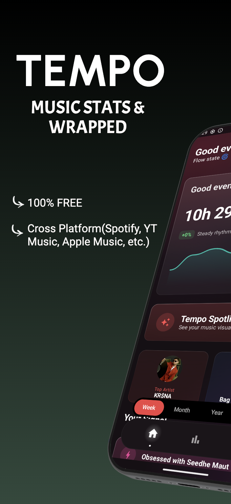
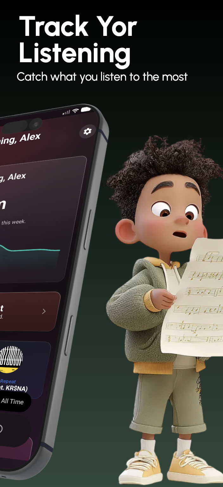
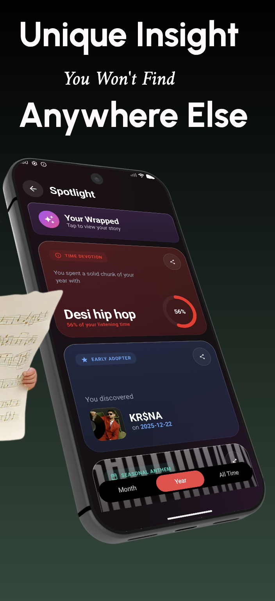
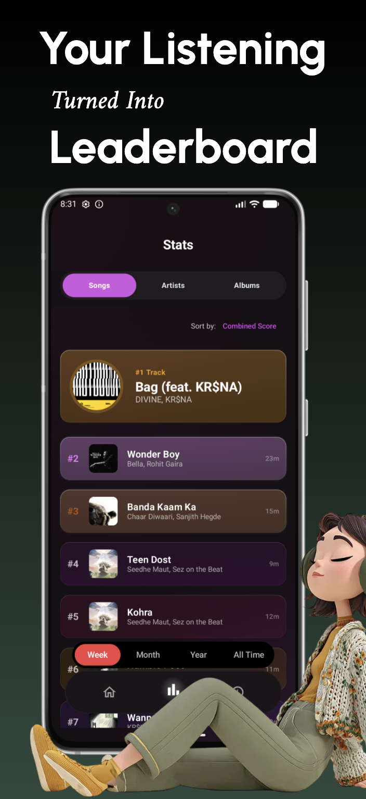
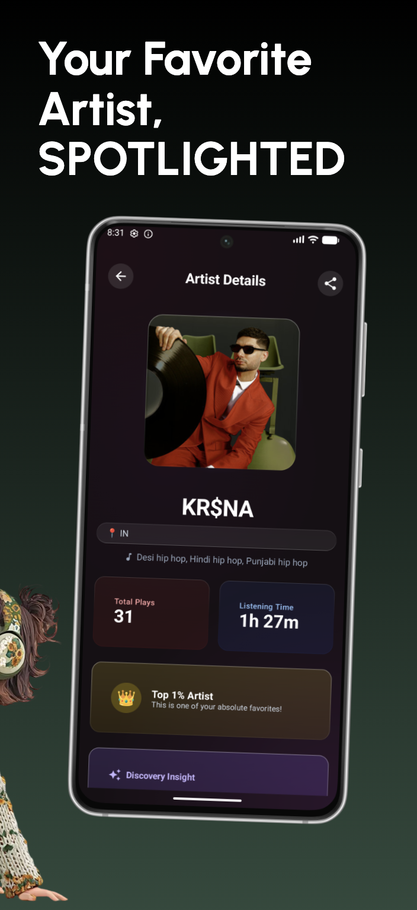
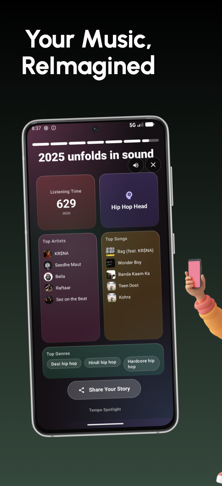
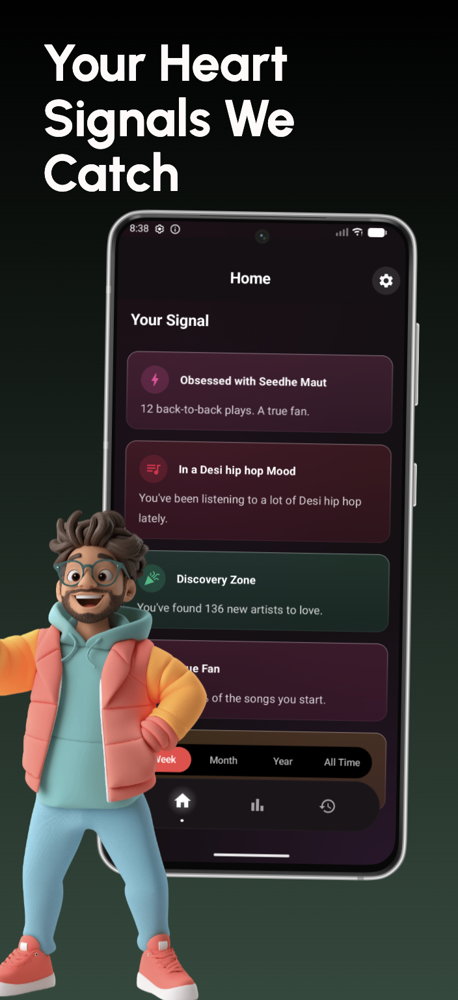

# Tempo

  

  

 
 

 

**Tempo** is a local-first music journal and scrobbler for Android. It runs in the background, tracks your listening history across your favorite media players, and generates beautiful visualizations of your listening habits directly on your device.

Unlike cloud-dependent tracking tools, Tempo prioritizes user privacy. All your data is stored locally and stays on your device.

---

## 📱 Screenshots

  
  
  
  

  
  
  

---

## ✨ Features

### 🎧 Universal Background Tracking
- Automatically tracks playback from Spotify, YouTube Music, Apple Music, Poweramp, and 50+ other Android audio players.
- Uses Android's `NotificationListenerService` to detect media events.
- Automatically filters out system alerts, podcasts, and audiobooks to keep your music stats accurate.

### 🔄 Data Import & Integration
- **Two-Tier Last.fm Import**: Imports legacy listening history without bloat. Your recent history is stored in the active set for analytics, while older history is compressed in an archive for lookup.
- **Spotify API Integration**: Connects to the Spotify API to fetch audio characteristics (energy, valence, danceability) for your tracks.
- **API-Only Mode**: Save battery by disabling the background listener and polling Spotify's API directly.

### 🎨 Spotlight Visualizations
Generates beautiful, shareable statistic cards using Jetpack Compose Canvas:
- **Circadian Rhythm**: A 24-hour radial chart mapping your peak activity hours.
- **Weekly Pulse**: A 3D isometric layout comparing weekday vs. weekend listening habits.
- **Forgotten Favorite**: Relights songs you haven't played in a long time, showing how many days have passed.
- **Sonic Immersion**: An optical art-inspired tunnel visualizing deep listening sessions.
- **Seasonal Poetry**: Dynamic, hemisphere-aware text summarizing your monthly listening mood.

### 💻 Desktop & Browser Sync
Sync music played on your PC, Mac, Linux machine, or browser to your phone over your local network:
- **Tauri Desktop Satellite**: Runs in the system tray and captures system now-playing audio events on macOS, Windows, and Linux.
- **Browser Extension**: An advanced companion extension that uses direct audio-element timing and tab URLs to track music on web players.
- **Secure Pairing**: Scan a QR code on your phone to pair instantly via mDNS. Payloads are signed with HMAC-SHA256 signatures for security over WiFi.

### 🏆 Profiles & Listening Milestones
- **XP & Levels**: Earn XP based on your listening duration and engagement level.
- **Listener Titles**: Unlock custom titles based on level and genre diversity (e.g. *Eclectic Wanderer*).
- **Daily Challenges**: Auto-generated daily tasks like "listen to a new artist" or "listen for 30 minutes without skipping" to earn bonus XP.
- **Milestone Badges**: Collect badges for listening milestones (e.g., first scrobble, 1000 hours).

### 🛡️ Play Integrity & OEM Protection
- **Anti-Spam Filter**: Discards consecutive loops of the same short track to prevent stat inflation.
- **Mute Detection**: Pauses tracking and XP accumulation when the device media volume is set to zero.
- **Keep-Alive Protection**: Includes self-healing background workers and instructions for aggressive OEM battery savers (Xiaomi/HyperOS, etc.).

### 📱 Home Screen Widgets & Detailed Views
- **Glance Widgets**: 7 distinct Android home screen widgets including heatmaps, now-playing, progress milestones, and recommendations.
- **Deep-Dive Screens**: Detailed statistics, listening history, and metadata editor tools for every Song, Artist, and Album.

### 🔒 Privacy & Architecture
- **Local-First**: All data is stored in a local SQLite database (via Room) on your device.
- **No Cloud Trackers**: The application has no tracking servers. Auth tokens for integrations are kept in Android's `EncryptedSharedPreferences`.
- **Local Backups**: Encrypted backups to your personal Google Drive with automated conflict resolution.

---

## 🛠️ Tech Stack

| Layer | Technology |
| :--- | :--- |
| **Languages** | Kotlin (100% Jetpack Compose) |
| **Architecture** | MVVM + Clean Architecture, Hilt |
| **Database** | Room SQLite, DataStore, EncryptedSharedPreferences |
| **Networking** | Retrofit + OkHttp |
| **Background Tasks** | WorkManager, Foreground Services |
| **UI & Charts** | Jetpack Glance (Widgets), Vico, MPAndroidChart |
| **Image Loading** | Coil |
| **Desktop Client** | Tauri (Rust + HTML/JS) |
| **SDK Targets** | Min SDK 26 (Android 8) / Target SDK 36 (Android 16) |

---

## 🤝 Contributing

Contributions of all kinds are welcome! Before starting work on major features, please open an issue to discuss your ideas.
- **Bug Fixes**: Submit a PR directly.
- **Documentation & Translations**: Feel free to improve instructions or add translations.

Please refer to [CONTRIBUTION.md](CONTRIBUTION.md) for more details.

---

## 📄 License & Philosophy

Tempo is licensed under a **custom modified AGPLv3 License**.

- **Allowed**: Study the code, build and run the app for personal use, audit security, and contribute back to the project.
- **Prohibited**: Selling the app, distributing modified/monetized versions, or rebranding and publishing the app to stores.

*This copyleft license keeps Tempo free, transparent, and collaborative while protecting the project from commercial exploitation and copycats.*

For full details, see the [LICENSE](LICENSE) file.

---

## 🙏 Acknowledgments

Made with ❤️ by [Avinash](https://github.com/avinaxhroy)
