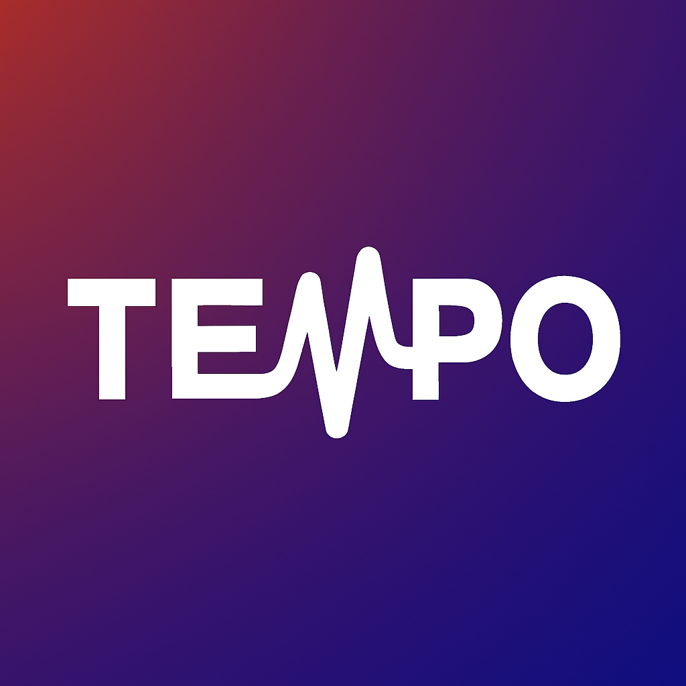

# Tempo

<p align="center">
  
</p>

<p align="center">
  <a href="https://play.google.com/store/apps/details?id=me.avinas.tempo.release">
    
  </a>
</p>

<div align="center">

[](https://kotlinlang.org) 
[](https://developer.android.com) 
[](Changelog.md)
[](LICENSE) 
[]()

</div>

Tempo is a local-first music journal and scrobbler for Android. It monitors playback across supported media players, records listening history into a local SQLite database, and computes listening analytics, heatmaps, and shareable stat cards on device without remote tracking servers.

---

## Screenshots

<p align="center">
  
  
  
  
</p>
<p align="center">
  
  
  
  
</p>

---

## Features

### Playback tracking
- Monitors audio playback from Spotify, YouTube Music, Apple Music, Poweramp, Tidal, and 50+ other Android media players via Android `NotificationListenerService`.
- Filters out non-music media events like podcasts, audiobooks, and system notifications.
- Pauses scrobbling when device media volume is muted.
- Deduplicates rapid consecutive loops of short tracks to prevent inflated play counts.
- Handles OEM background restrictions with periodic worker checks and recovery flushes.

### Analytics and detail views
- Computes play counts, listening duration, heatmaps, and timeline trends for tracks, artists, and albums.
- Calculates a Listening Quality Score (LQS) based on completion rate, replay frequency, and skip behavior.
- Maps acoustic characteristics (energy, valence, danceability) to track listening mood patterns.
- Includes a live search on ranking screens that filters by song, artist, or album with global rank indicators.

### Spotlight cards and export
- Renders exportable stat summaries with Jetpack Compose Canvas:
  - 24-hour radial activity distribution (Circadian Rhythm).
  - Weekday vs. weekend comparison (Weekly Pulse).
  - Inactive tracks with days elapsed since last play (Forgotten Favorite).
  - Monthly listening recap summaries.
- Supports six export themes (Midnight, Rose, Aurora, Mono, Daylight, Ocean) with theme-specific geometry and typography for light and dark backgrounds.

### Browser companion extension
- Manifest V3 extension (Chrome and Firefox) that logs web playback from YouTube Music, Spotify Web, SoundCloud, Bandcamp, Apple Music Web, Deezer, and Tidal Web.
- Measures listen time directly from HTML media element playback positions rather than wall-clock timers.
- Syncs queued plays over local Wi-Fi to the phone's internal HTTP receiver (`POST /api/plays`), authenticated with HMAC-SHA256 signatures.

### Data imports and external sources
- Last.fm: Imports complete historical scrobbles using a split storage model (recent history in the active query set, older history in an indexed archive).
- YouTube Music / Google Takeout: Parses multi-part ZIP exports and localized `watch-history.json` files across languages.
- Spotify Web API: Fetches track audio features and supports an API-only polling mode to save battery when notification tracking is disabled.
- MusicBrainz: Retrieves album cover art, release details, and genre tags.

### Library corrections
- Split merged artists directly from the artist details menu.
- Rename artists across all associated tracks, multi-artist credits, and cached stats in a single operation.
- Unicode normalization (NFKC) prevents Japanese, Korean, and Cyrillic artist names from collapsing into duplicate records.

### Widgets and profiles
- 7 Jetpack Glance home screen widgets, including now-playing monitors, heatmaps, daily stats, and recommendations.
- Daily challenges, listening milestones, and XP progression handled via background WorkManager tasks.

### Local storage and privacy
- All listening events, track metadata, and aggregates remain in local SQLite databases via Room.
- Auth credentials and API tokens reside in Android `EncryptedSharedPreferences`.
- Optional Google Drive backup exports database snapshots with conflict resolution over HTTPS.

---

## Tech stack

| Component | Stack |
| :--- | :--- |
| **Language** | Kotlin 2.2 |
| **UI** | 100% Jetpack Compose (Material 3) |
| **Architecture** | MVVM, Clean Architecture, Hilt DI |
| **Persistence** | Room SQLite, DataStore Preferences, EncryptedSharedPreferences |
| **Background execution** | WorkManager, Foreground Services |
| **Networking & Serialization** | Retrofit, OkHttp, Moshi |
| **Charts & Widgets** | Jetpack Glance, Vico, MPAndroidChart |
| **Image loading** | Coil |
| **Local sync receiver** | Embedded NanoHTTPD server, ZXing QR pairing, CameraX |
| **Browser extension** | TypeScript, Manifest V3 (Chrome & Firefox) |
| **Target platforms** | Android 8.0+ (Min SDK 26, Target SDK 36, Compile SDK 36) |

---

## Building the project

### Prerequisites
- Android Studio Ladybug or newer
- JDK 17
- Android SDK 36

### Build the Android app

1. Clone the repository:
   ```bash
   git clone https://github.com/avinaxhroy/Tempo.git
   cd Tempo
   ```

2. (Optional) Configure API credentials in `local.properties` at the project root:
   ```properties
   SPOTIFY_CLIENT_ID=your_spotify_client_id
   LASTFM_API_KEY=your_lastfm_api_key
   GOOGLE_WEB_CLIENT_ID=your_google_client_id
   ```

3. Build the debug APK:
   ```bash
   ./gradlew assembleDebug
   ```

4. Run unit tests:
   ```bash
   ./gradlew test
   ```

### Build the browser extension

1. Navigate to the extension folder:
   ```bash
   cd browser-extension
   npm install
   ```

2. Compile Chrome and Firefox distributions:
   ```bash
   npm run build
   ```

3. Load the unpacked extension from `browser-extension/dist` in `chrome://extensions` (with Developer Mode enabled).

---

## Contributing

Contributions fixing bugs, improving translations, or enhancing documentation are welcome.

1. For major changes or new features, open an issue first to discuss the approach.
2. Ensure new code follows existing architecture patterns and passes `./gradlew build`.
3. Submit a pull request with a description of the changes, reproduction steps for bug fixes, and screenshots for UI updates.

See [CONTRIBUTION.md](CONTRIBUTION.md) for full guidelines.

---

## License

Tempo is released under a modified AGPLv3 license. You may inspect the source code, build and run the app for personal use, audit its security, and contribute improvements back to the repository. Commercial use, monetization, closed-source distribution, and rebranding are prohibited.

See [LICENSE](LICENSE) for the full license text.
